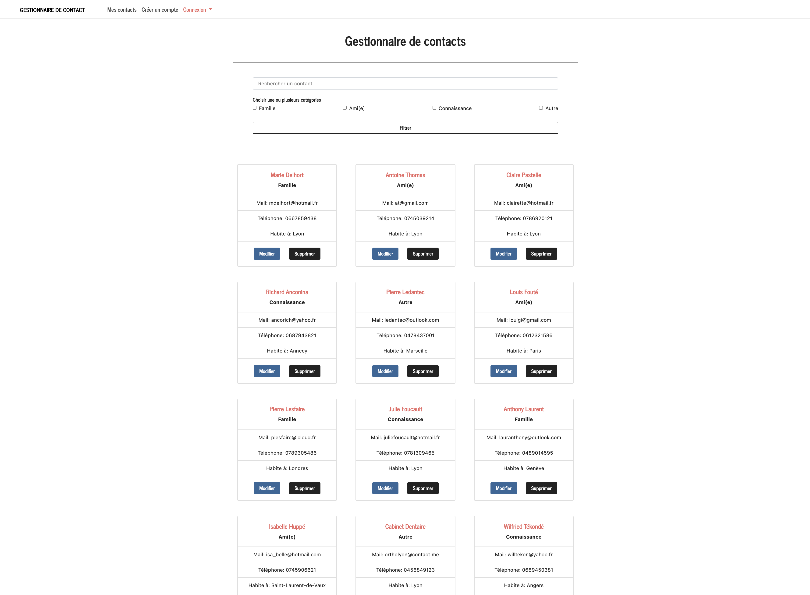

# Gestionnaire de Contacts

Application de gestion de contacts réalisée avec Symfony (pour mon compte personnel) permettant d'afficher une liste de contacts avec diverses informations. Possibilité d'ajouter, éditer ou supprimer un contact si rôle d'administrateur ainsi que de rechercher un contact par son nom et/ou de trier les contacts par catégories.

## 💫 Demo

Vidéo de démonstration de la v1 du site disponible [ici](https://drive.google.com/file/d/1ymH6R5VlYV9ljWj2izUu6CHX-Pce1aku).
